# Architecture Diagrams
## PEBL DataApp System Architecture

**Note:** These are Mermaid diagrams that render in GitHub and modern markdown viewers.

---

## Table of Contents
1. [High-Level System Architecture](#1-high-level-system-architecture)
2. [Authentication Flow](#2-authentication-flow)
3. [Data Ingestion Pipeline](#3-data-ingestion-pipeline)
4. [File Upload & Storage Flow](#4-file-upload--storage-flow)
5. [Map Rendering Pipeline](#5-map-rendering-pipeline)
6. [Project Sharing Flow](#6-project-sharing-flow)
7. [Database Schema ERD](#7-database-schema-erd)
8. [Service Layer Architecture](#8-service-layer-architecture)
9. [Component Hierarchy](#9-component-hierarchy)
10. [Data Flow: Pin Creation](#10-data-flow-pin-creation)

---

## 1. High-Level System Architecture

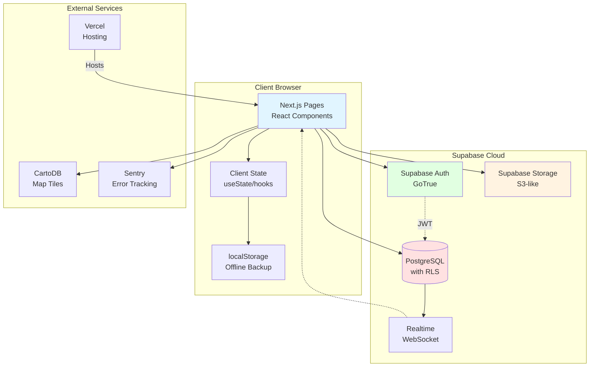

---

## 2. Authentication Flow

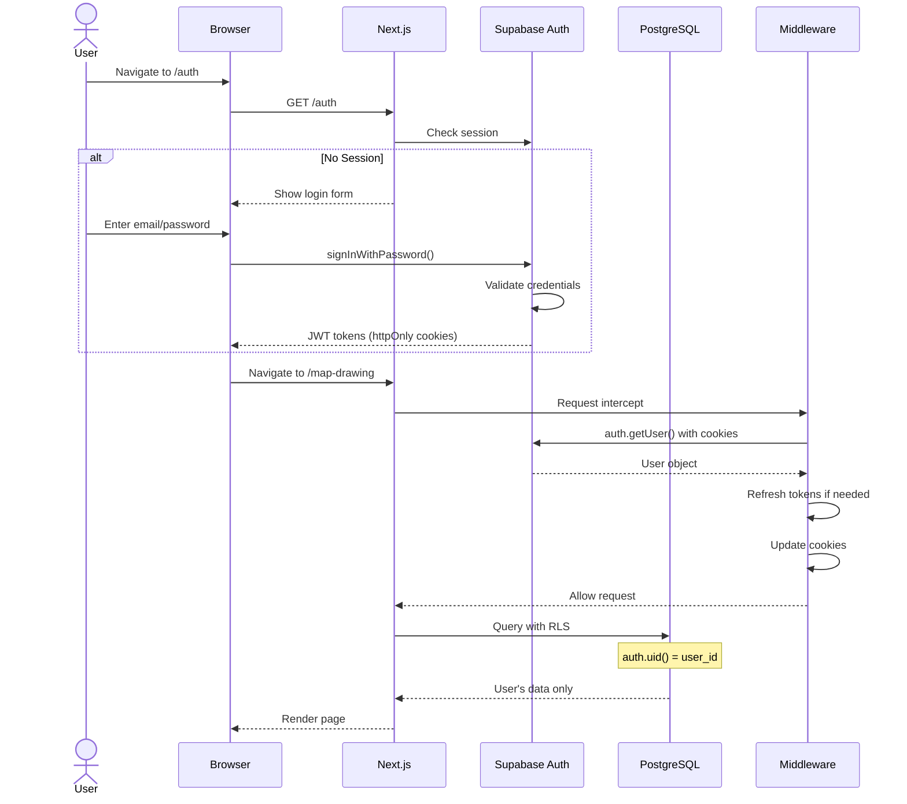

---

## 3. Data Ingestion Pipeline

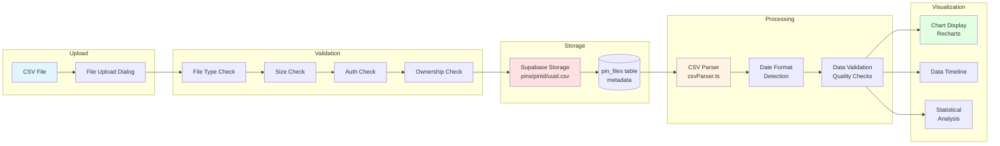

---

## 4. File Upload & Storage Flow

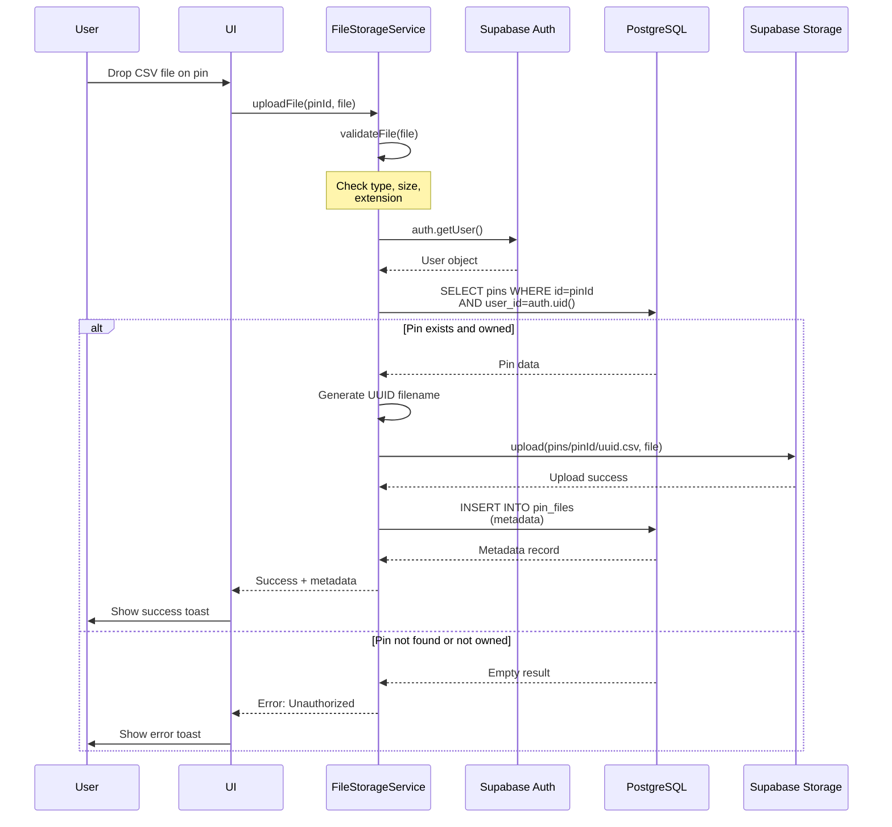

---

## 5. Map Rendering Pipeline

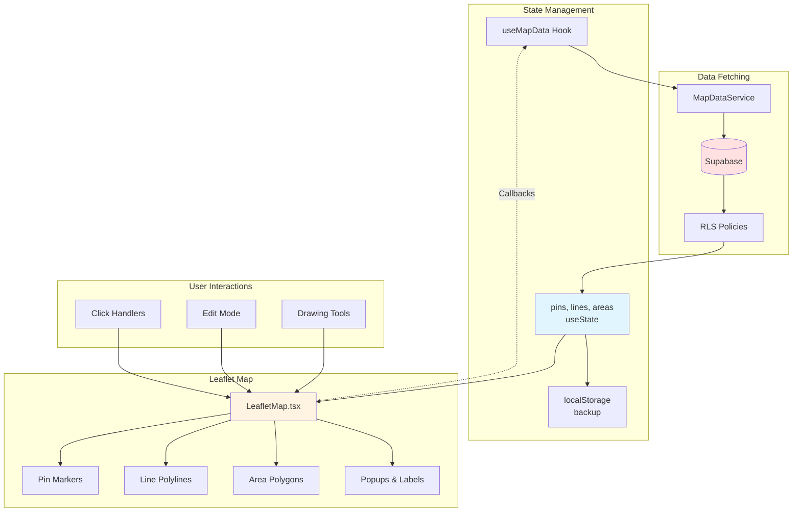

---

## 6. Project Sharing Flow

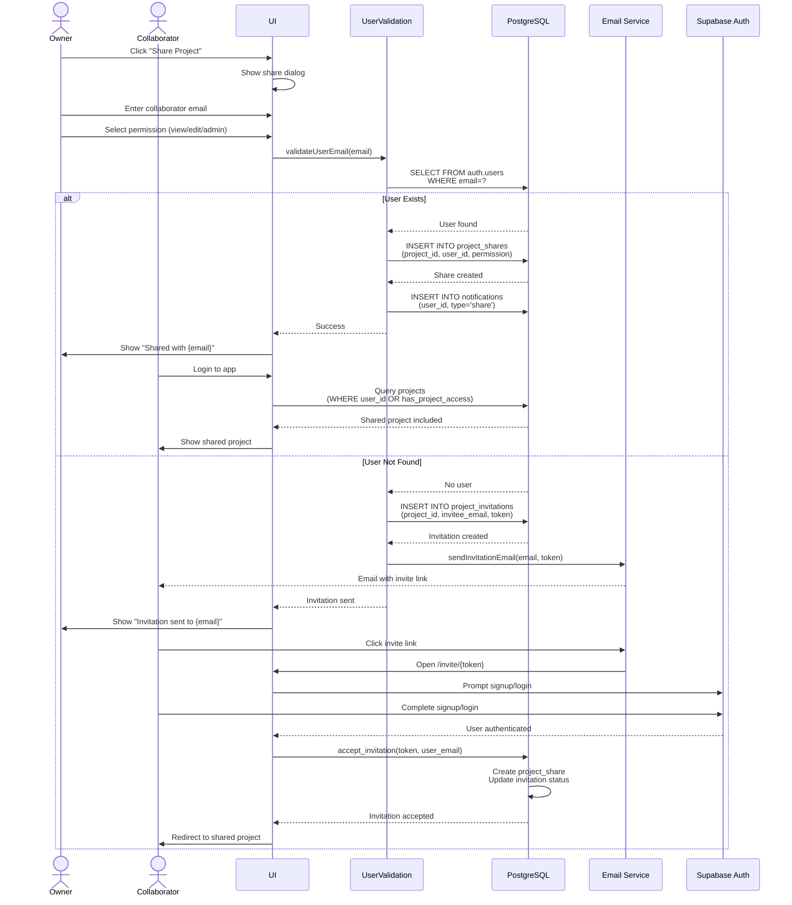

---

## 7. Database Schema ERD

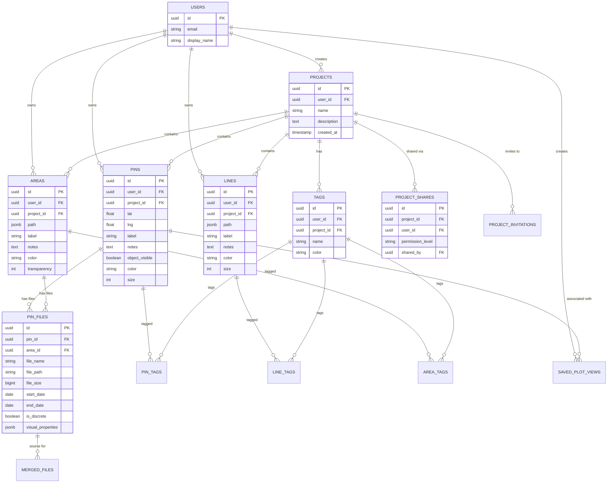

---

## 8. Service Layer Architecture

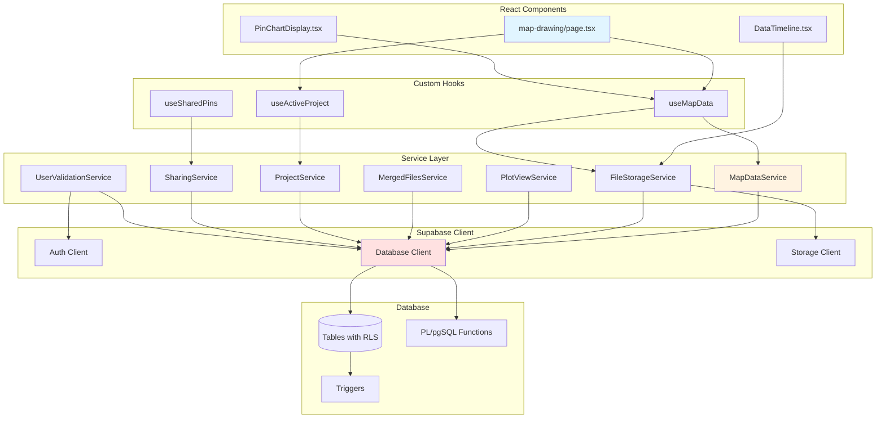

---

## 9. Component Hierarchy

```mermaid
graph TB
    ROOT[app/layout.tsx<br/>Root Layout]

    subgraph "Authentication"
        AUTH_PAGE[auth/page.tsx]
        AUTH_FORM[AuthForm.tsx]
        USER_MENU[UserMenu.tsx]
    end

    subgraph "Main Application"
        MAP_PAGE[map-drawing/page.tsx<br/>8,385 lines]

        subgraph "Map Components"
            LEAFLET[LeafletMap.tsx]
            SIMPLE_MAP[SimpleLeafletMap.tsx]
            DATA_MAP[DataExplorerMap.tsx]
        end

        subgraph "Data Display"
            PIN_CHART[PinChartDisplay.tsx]
            TIMELINE[DataTimeline.tsx]
            MARINE_GRID[MarinePlotsGrid.tsx]
            HEATMAP[HaplotypeHeatmap.tsx]
        end

        subgraph "Dialogs & Modals"
            FILE_UPLOAD[FileUploadDialog]
            PIN_EDIT[PinEditDialog]
            PROJECT_SETTINGS[ProjectSettingsDialog]
            SHARING[SharingDialog]
        end
    end

    subgraph "Data Explorer"
        EXPLORER_PAGE[data-explorer/page.tsx]
        FILE_ACTIONS[FileActionsDialog]
        OUTLIER[OutlierCleanupDialog]
    end

    ROOT --> AUTH_PAGE
    ROOT --> MAP_PAGE
    ROOT --> EXPLORER_PAGE

    AUTH_PAGE --> AUTH_FORM
    ROOT --> USER_MENU

    MAP_PAGE --> LEAFLET
    MAP_PAGE --> PIN_CHART
    MAP_PAGE --> TIMELINE
    MAP_PAGE --> MARINE_GRID
    MAP_PAGE --> FILE_UPLOAD
    MAP_PAGE --> PIN_EDIT
    MAP_PAGE --> PROJECT_SETTINGS
    MAP_PAGE --> SHARING

    EXPLORER_PAGE --> DATA_MAP
    EXPLORER_PAGE --> FILE_ACTIONS
    EXPLORER_PAGE --> OUTLIER

    style MAP_PAGE fill:#ffe1e1
    style LEAFLET fill:#fff3e1
    style PIN_CHART fill:#e1ffe1
```

---

## 10. Data Flow: Pin Creation with File Upload

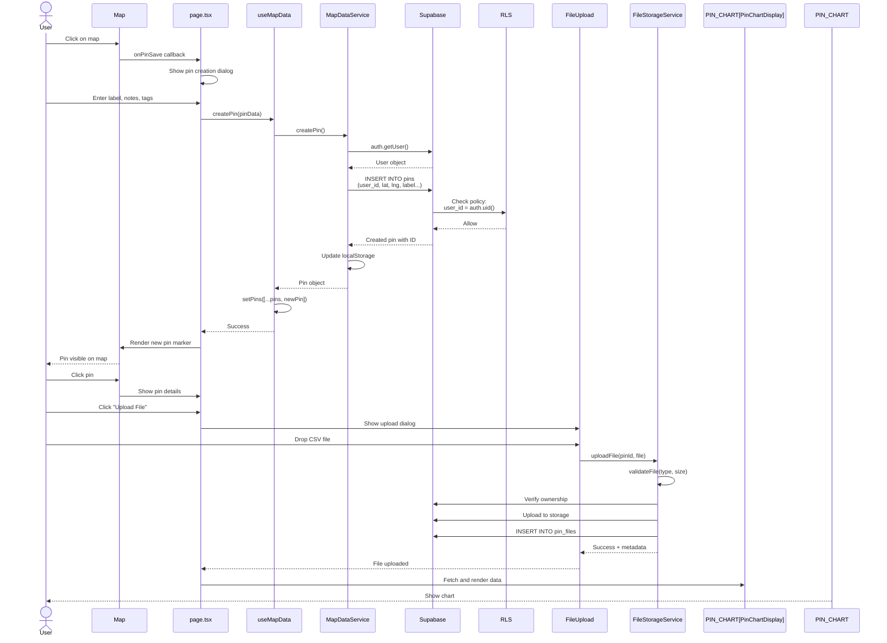

---

## 11. RLS Security Model

```mermaid
graph TB
    subgraph "Client Request"
        CLIENT[Supabase Client<br/>with JWT]
    end

    subgraph "Supabase Server"
        AUTH_CHECK{auth.uid()<br/>extracted from JWT}
    end

    subgraph "PostgreSQL"
        QUERY[Query Execution]

        subgraph "RLS Policies"
            POLICY1[Policy: user_id = auth.uid]
            POLICY2[Policy: has_project_access]
            POLICY3[Policy: is_shared_with_user]
        end

        TABLES[(Tables)]
    end

    subgraph "Response"
        FILTERED[Filtered Results<br/>User's data only]
    end

    CLIENT --> AUTH_CHECK
    AUTH_CHECK --> QUERY
    QUERY --> POLICY1
    QUERY --> POLICY2
    QUERY --> POLICY3

    POLICY1 --> TABLES
    POLICY2 --> TABLES
    POLICY3 --> TABLES

    TABLES --> FILTERED
    FILTERED --> CLIENT

    style AUTH_CHECK fill:#ffe1e1
    style POLICY1 fill:#e1ffe1
    style FILTERED fill:#e1f5ff
```

---

## 12. CSV Parsing Pipeline

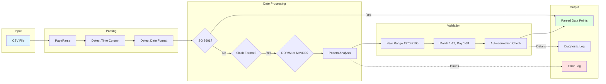

---

## 13. Performance Optimization Points

```mermaid
graph TB
    subgraph "Frontend"
        BUNDLE[Bundle Splitting<br/>Framework/Supabase/Charts]
        LAZY[Lazy Loading<br/>Components]
        MEMO[Memoization<br/>useMemo/useCallback]
    end

    subgraph "Map"
        RAF[RequestAnimationFrame<br/>Throttling]
        VIEWPORT[Viewport Culling<br/>TODO]
        CLUSTER[Marker Clustering<br/>TODO]
    end

    subgraph "Data"
        CACHE[localStorage Cache]
        DEBOUNCE[Debounced Queries]
        BATCH[Batch Operations]
    end

    subgraph "Database"
        INDEXES[Proper Indexes<br/>user_id, project_id]
        RLS[Efficient RLS Policies]
        JOINS[Single-Query Joins]
    end

    subgraph "Network"
        CDN[CDN for Tiles<br/>CartoDB]
        COMPRESSION[Gzip/Brotli]
        HTTP2[HTTP/2]
    end

    BUNDLE -.->|Reduces| LAZY
    LAZY -.->|Improves| MEMO
    RAF -.->|Enables| VIEWPORT
    VIEWPORT -.->|With| CLUSTER
    CACHE -.->|Backs| DEBOUNCE
    DEBOUNCE -.->|Enables| BATCH
    INDEXES -.->|Speed| RLS
    RLS -.->|Optimized| JOINS

    style RAF fill:#e1ffe1
    style CACHE fill:#fff3e1
    style INDEXES fill:#ffe1e1
```

---

## 14. Deployment Architecture

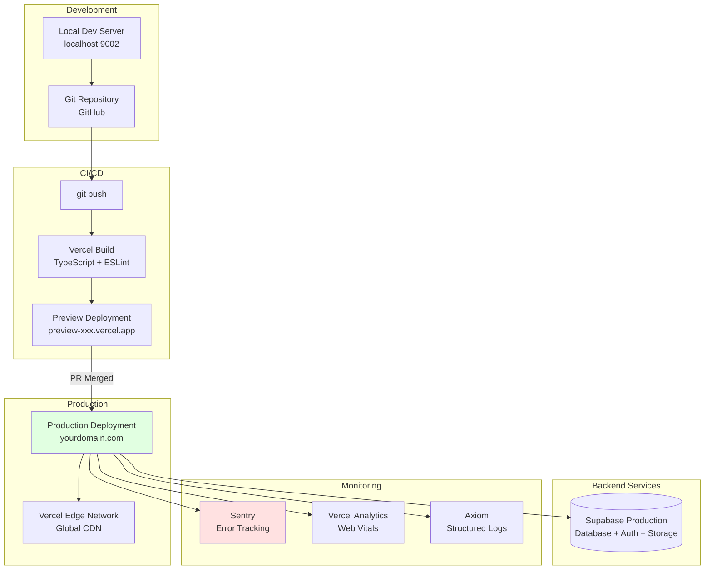

---

## Notes

- **Mermaid Syntax:** These diagrams use Mermaid.js syntax and render automatically in:
  - GitHub README/markdown files
  - GitLab
  - VS Code (with Mermaid extension)
  - Many documentation tools

- **Export Options:** To export as images:
  ```bash
  npm install -g @mermaid-js/mermaid-cli
  mmdc -i ARCHITECTURE_DIAGRAMS.md -o diagrams/
  ```

- **Interactive Editing:** Use https://mermaid.live/ to edit and preview

---

**Document Status:** Complete
**Total Diagrams:** 14
**Next:** Refer to specific diagram by section number
